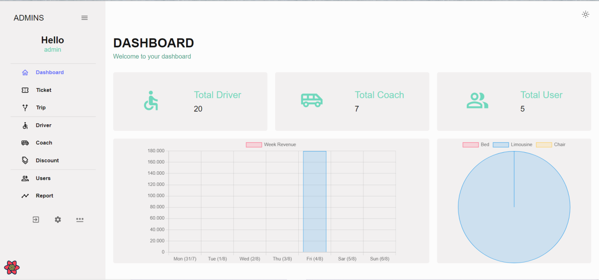

# Bus-Ticket-Booking-Full

A website allows customers to book tickets on a bus (coach), they can choose the route, seats on the bus and proceed with the payment.

## Installation

__Front-end__: just cd to the Frontend Folders (Admin & Cust) then run this cmd to install libraries:

```bash
npm install
```

To run: cd /BusTicketBooking-Frontend/Admin or Cust then:
```bash
npm run dev
```

__Back-end__: open IntelliJ, then File -> Open -> Choose the BusTicketBooking-Backend -> Click "Open"

# Some demo pictures:

__FRONT-END CUSTOMER UI__


__FRONT-END ADMIN UI__




